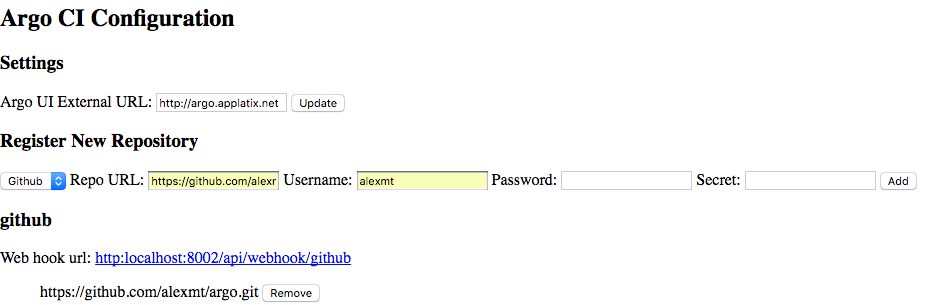

**THIS PROJECT IS NO LONGER MAINTAINED. PLEASE TAKE A LOOK AT THE ARGO EVENTS PROJECT INSTEAD (https://github.com/argoproj/argo-events)**

# Argo CI

Argo CI is a continuous integration and deployment system powered by [Argo](http://argoproj.io) workflow engine for Kubernetes. Argo CI provides integration with SCM
( currently only Github is supported) and automatically triggers CI workflow defined using [Argo YAML DSL](https://applatix.com/open-source/argo/docs/argo_v2_yaml.html).

## Deploy Argo CI to your kubernetes cluster

Argo CI might be installed using Helm:

```
helm repo add argo https://argoproj.github.io/argo-helm/
helm install argo/argo-ci --name argo-ci
```

The `argo-ci` helm chart installs three deployments:
- Argo workflow controller
- Argo UI deployment
- Argo CI deployment

Argo UI and Argo CI are available externally via load balancer kubernetes services.

## Configure integration with Github

Following steps are required to configure integration:

* For security reasons Argo CI configuration UI is not available externally. Easiest way to access it is to use port forwarding: `kubectl port-forward <argo-ci-pod> 8002:8002`.
UI should be available via http://localhost:8002.
* Configure external Argo UI URL using Argo CI configuration UI.
* Add required repositories using Argo UI:



* Create webhook using [Github UI](https://developer.github.com/webhooks/creating/#setting-up-a-webhook):
  * set Payload URL to `http<ArgoCiDomain>/api/webhook/github`
  * set Content Type to `application/json`
  * set your Secret token values
* Create build workflow and save at `.argo-ci/ci.yaml` inside of your project repository. If workflow has parameters named `revision` and `repo` then Argo CI will automatically set values for these parameters.

## Build and debug

To build project locally install [nodejs](https://nodejs.org) and [yarn](https://yarnpkg.com). Once you install npm dependencies using `yarn install` you are ready to build and
debug project locally:

* Execute `yarn build` to build project. Command stores build results in `./dist` directory.
* Execute `yarn start` to start service locally.
